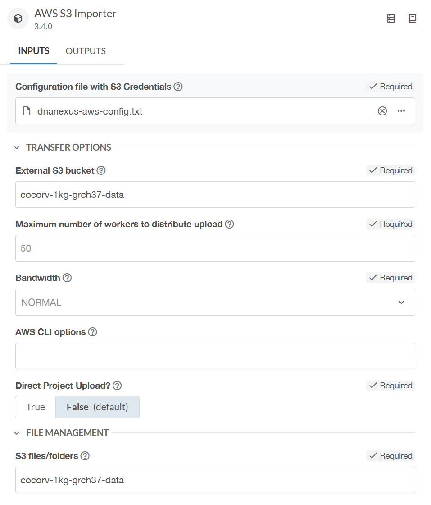
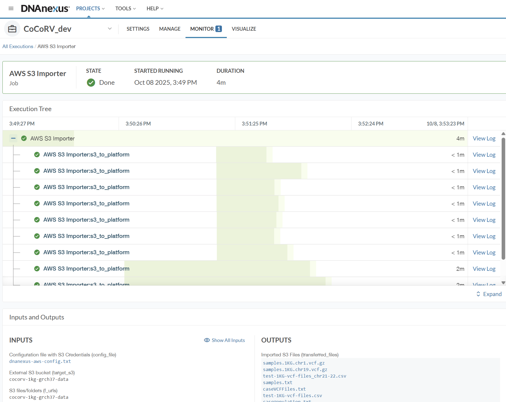

# nf-core/rarevariantburden (CoCoRV-nf): DNAnexus Implementation

## Introduction

This documentation will guide you how to implement **nf-core/rarevariantburden (CoCoRV-nf)** pipeline on DNAnexus cloud platform.

## Importing nf-core/rarevariantburden (CoCoRV-nf) pipeline

## Step 1: Import via the User Interface (UI)

Go to a DNAnexus project. Click 'Add' and from the drop down menu select 'Import Pipeline/Workflow'.

Next enter the required information (see below) and click 'Start Import':

<picture align="center">

</picture>

You will see that a Nextflow Pipeline Importer job will start running and after finishing the job successfully, you should see the 'CoCoRV-nf' applet inside the folder you specified to save the applet.

<picture align="center">

</picture>

## Step 2: Test run the pipeline from the UI

We will run the test profile for 'rarevariantburden' which should take ~30 mins to run. The test profile inputs are the nextflow outdir and -profile test,docker [test profile](https://github.com/nf-core/rarevariantburden/blob/dev/conf/test.config)

- Click on the 'CoCoRV-nf' applet that you created
- Type in a 'Job Name' for example 'rarevariantburden-test' and click on 'Output to' then make a folder or choose an existing folder, where the output will be saved.

<picture align="center">

</picture>

- Click 'Next'. This page contains input option for all pipeline parameters. As we are running the 'test' profile, we only need to fill up 2 inputs. One is `outdir` parameter and another is `profile` parameter.

- Type in a folder name for the `outdir` parameter (example value: `./test`, this will create a folder named 'test' inside the 'Output to' location you specified before, all pipeline results will be inside this 'test' folder). The outdir path must start with ./ or have no slashes in front of it so that the executor will be able to make this folder where its is running on the head node. For example './results' and 'results' are both valid but '/results' or things like 'dx://project-XXX:/results' will not produce output in your project.

- Scroll down and in 'Nextflow Options', 'Nextflow Run Options' type `-profile test,docker`. You must use `-profile docker` for all DNAnexus Nextflow pipeline run. Here we are going to run the 'test' profile, you need to specify 'test' also besides 'docker' profile.

- Then click 'Start Analysis' and click 'Launch Analysis'.

- After clicking the 'Launch Analysis' button, you will see that a new job will start running with the name you specified before. Go to the Monitor tab to see your running job.

- After the job finished successfully, you can click on the job link and can see output folder link and log files.

<picture align="center">

</picture>

## Step 3: Download data from AWS s3 bucket

In order to download data from AWS s3 bucket you need a Amazon AWS account, visit https://aws.amazon.com/ to create an account and login. You need to create an access key to import data from s3 bucket. Go to 'IAM' > 'Security credentials' and then find 'Access Keys' section. Click on 'Create access key' to create an access key and associated secret key, also specicy the region (example region 'us-east-1'). Save the newly created access key and secret key. Create a config.txt file (see below) and upload it to your DNAnexus project, you will need this file to launch the AWS s3 importer tool which will import data from external s3 bucket to your DNAnexus project folder.

```config file title="config.txt"
[default]
aws_access_key_id=[Access key generated by AWS]
aws_secret_access_key=[Secret Access key generated by AWS]
region=[Region]
```

Go to your DNAnexus project home, and click on 'Add', from the drop down menu select 'Import From AWS S3', put a job name and select a output folder where you want to save the s3 bucket data. Click 'Next'. In the 'Configuration file with S3 Credentials', you need to select the config file you created with your AWS access key credentials. Also put the bucket name in the 'External S3 bucket' and put the s3 folder name you want to copy in the 'S3 files/folders'. Here is an example screeshot for importing our s3 bucket folder with 1KG test datasets 's3://cocorv-1kg-grch37-data/'.

<picture align="center">

</picture>

Then click 'Start Analysis' and click 'Launch Analysis'.

After clicking the 'Launch Analysis' button, you will see that a new job will start running with the name you specified before. Go to the Monitor tab to see your running job.

After the job finished successfully, you can click on the job link and can see output folder link.

<picture align="center">

</picture>

You can download the control data, annovar data, and vep data in a similar way.

## Step 4: Run the pipeline with 1KG project test data

We prepared a test dataset using 25 samples from 1000 Genomes project. You can download this dataset from AWS s3 bucket: 's3://cocorv-1kg-grch37-data/'.

For control data, you need to download the control data from our Amazon AWS s3 bucket. We provide 3 different control datasets, For build GRCh37, we have gnomADv2exome data, for build GRCh38, we have gnomADv4.1exome and gnomADv4.1genome data as controls.

Here are the s3 bucket paths of the 3 gnomAD control datasets:

- s3://cocorv-resource-files/gnomADv2exome/
- s3://cocorv-resource-files/gnomADv4.1exome/
- s3://cocorv-resource-files/gnomADv4.1genome/

You also need to download the annovar and VEP resource folders for running Annovar and VEP annotation.

Here are the s3 bucket paths of the annotation tool datasets:

- s3://cocorv-resource-files/annovarFolder/
- s3://cocorv-resource-files/vepFolder/

These are the files we need for running CoCoRV-nf pipeline with 1KG project test data:

1. Case VCF files and sample list file: s3://cocorv-1kg-grch37-data/
2. gnomADv2exome control dataset: s3://cocorv-resource-files/gnomADv2exome/
3. ANNOVAR annotation files: s3://cocorv-resource-files/annovarFolder/

Download all these folders using DNAnexus's AWS S3 Importer tool.

Click on the 'CoCoRV-nf' applet that you created. Type in a 'Job Name' for example 'rarevariantburden-1KG-test' and click on 'Output to' then make a folder or choose an existing folder. Click 'Next'. This page contains input option for all pipeline parameters. Type in all the parameter values as shown below:

In 'Inputs' section, you need to fill up these parameters, caseSample, caseJointVCF, caseBed, and caseVCFFileList. For caseSample, select the 's3://cocorv-1kg-grch37-data/cocorv-1kg-grch37-data/samples.txt' file downloaded from s3 bucket in your project directory. For 'caseJointVCF', put 'NA'. For caseBed, select the 's3://cocorv-1kg-grch37-data/cocorv-1kg-grch37-data/samples.1KG.coverage10x.bed.gz' file downloaded in your project directory. For caseVCFFileList, you need to prepare a file which contains file path for all the chromosomes you want to run the analysis. An example file is given in here: s3://cocorv-1kg-grch37-data/cocorv-1kg-grch37-data/test-1KG-vcf-files.csv. You need to update the file paths with file paths inside your DNAnexus project. For example, a file path like this 's3://cocorv-1kg-grch37-data/samples.1KG.chr1.vcf.gz' needs to be changed into 'dx://project-XXX:/cocorv-1kg-grch37-data/samples.1KG.chr1.vcf.gz'. If you want to run only for some chromosomes, for example, chr 21 and 22, you need to put chr number and file path for those 2 chromosomes only.

In the 'Commons' section, fill up 'annovarFolder' option with the folder you downloaded from 's3://cocorv-resource-files/annovarFolder/'. In the 'controlDataFolder' option, fill up with the folder you downloaded from 's3://cocorv-resource-files/gnomADv2exome/'. In 'outdir' option, give an output folder name (example: ./results). As we are running for gnomADv2 GRch37 data, we need to provide these options also, 'reference' is 'GRCh37', 'gnomADVersion' is 'v2exome', and 'AFMax' is '0.0001'.

Scroll down and in 'Nextflow Options', 'Nextflow Run Options' type `-profile docker -queue-size 50`. You must use `-profile docker` for all DNAnexus Nextflow pipeline run. It is better to add the queue size also in here in order to run multiple jobs in parallel.

Here is a summary of the input options needed:

'Inputs' section:

- caseSample: dx://project-XXX:/cocorv-1kg-grch37-data/samples.txt
- caseJointVCF: NA
- caseBed: dx://project-XXX:/cocorv-1kg-grch37-data/samples.1KG.coverage10x.bed.gz
- caseVCFFileList: dx://project-XXX:/cocorv-1kg-grch37-data/test-1KG-GRCh37-files.csv

'Commons' section:

- vepFolder: NA
- annovarFolder: dx://project-XXX:/annovarFolder
- controlDataFolder: dx://project-XXX:/gnomADv2exome
- outdir: ./results
- reference: GRCh37
- gnomADVersion: v2exome
- AFMax: 0.0001

'Nextflow Options' section

- Nextflow Run Options: -profile docker -queue-size 50

Then click 'Start Analysis' and click 'Launch Analysis'.

After clicking the 'Launch Analysis' button, you will see that a new job will start running with the name you specified before. Go to the Monitor tab to see your running job.

After the job finished successfully, you can click on the job link and can see output folder link and log files. It will take ~1hr 30mins to finish running CoCoRV for this 1KG test dataset.
