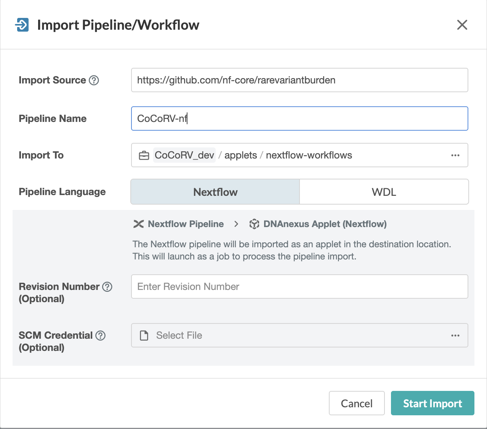
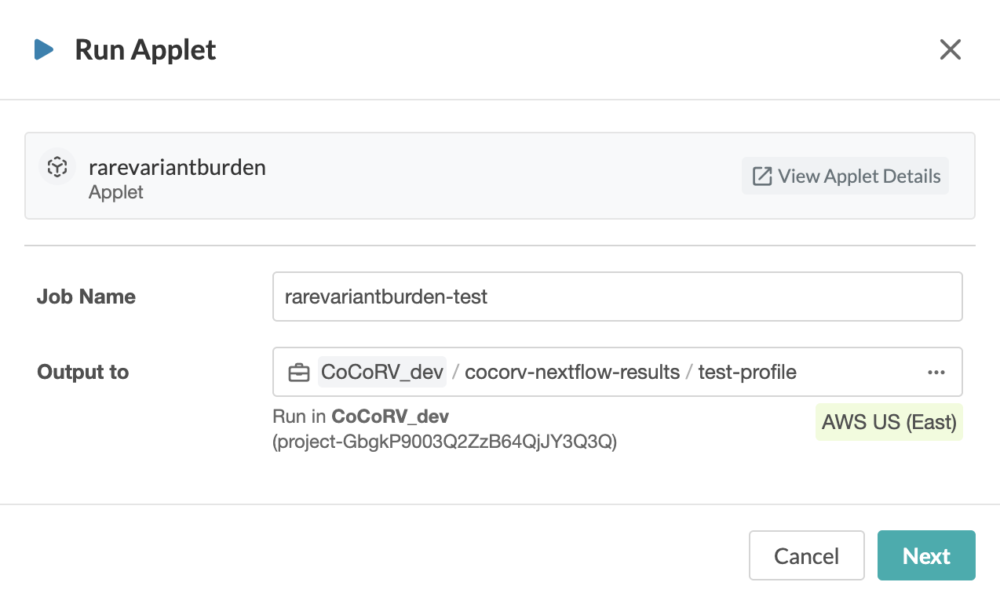
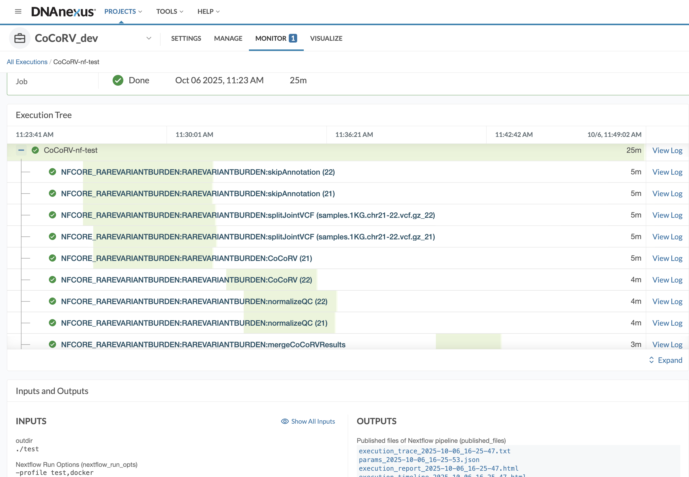

# nf-core/rarevariantburden (CoCoRV-nf): DNAnexus Implementation

## Introduction

This documentation will guide you how to implement **nf-core/rarevariantburden (CoCoRV-nf)** pipeline on DNAnexus cloud platform.

## Importing nf-core/rarevariantburden (CoCoRV-nf) pipeline

## Step 1: Import via the User Interface (UI):

Go to a DNAnexus project. Click 'Add' and from the drop down menu select 'Import Pipeline/Workflow'.

Next enter the required information (see below) and click 'Start Import':

<picture align="center">

</picture>

You will see that a Nextflow Pipeline Importer job will start running and after finishing the job successfully, you should see the 'CoCoRV-nf' applet inside the folder you specified to save the applet.

<picture align="center">

</picture>

## Step 2: Test run the pipeline from the UI:
We will run the test profile for 'rarevariantburden' which should take ~30 mins to run. The test profile inputs are the nextflow outdir and -profile test,docker [test profile](https://github.com/nf-core/rarevariantburden/blob/dev/conf/test.config)

- Click on the 'CoCoRV-nf' applet that you created
- Type in a 'Job Name' for example 'rarevariantburden-test' and click on 'Output to' then make a folder or choose an existing folder. 

<picture align="center">

</picture>

- Click 'Next'. This page contains input option for all pipeline parameters. As we are running the 'test' profile, we only need to fill up 2 inputs. One is `outdir` parameter and another is `profile` parameter.

- Type in a folder name for the `outdir` parameter (example value: `./test`, this will create a folder named 'test' inside the 'Output to' location you specified before, all pipeline results will be inside this 'test' folder). The outdir path must start with ./ or have no slashes in front of it so that the executor will be able to make this folder where its is running on the head node. For example './results' and 'results' are both valid but '/results' or things like 'dx://project-xx:/results' will not produce output in your project. Once the dnanexus nextflow executor detects that all files have been written to this folder (and thus all subjobs completed), it will copy this folder to the specified job destination on platform. In the event that the pipeline fails before completion, this folder will not be written to the 'Output to' folder.

- Scroll down and in 'Nextflow Options', 'Nextflow Run Options' type `-profile test,docker`. You must use `-profile docker` for all DNAnexus Nextflow pipeline run, as here we are going to run the 'test' profile, you need to specify 'test' also.

- Then click 'Start Analysis' and click 'Launch Analysis'.

- After clicking the 'Launch Analysis' button, you will see that a new job will start running with the name you specified before. Go to the Monitor tab to see your running job.

- After the job finished successfully, you can click on the job link and can see output folder link and log files.

<picture align="center">

</picture>

## Step 3: Run the pipeline for real datasets

We prepared a test dataset using 25 samples from 1000 Genomes project. You can download this dataset from AWS s3 bucket: "https://cocorv-1kg-grch37-data.s3.amazonaws.com/". 

For control data, you need to download the control data from our Amazon AWS s3 bucket. We provide 3 different control datasets, For build GRCh37, we have gnomADv2exome data, for build GRCh38, we have gnomADv4.1exome and gnomADv4.1genome data as controls.

Here are the s3 bucket paths of the 3 gnomAD control datasets:

- s3://cocorv-resource-files/gnomADv2exome/
- s3://cocorv-resource-files/gnomADv4.1exome/
- s3://cocorv-resource-files/gnomADv4.1genome/

You also need to download the annovar and VEP resource folders for running Annovar and VEP annotation.

Here are the s3 bucket paths of the annotation tool datasets:

- s3://cocorv-resource-files/annovarFolder/
- s3://cocorv-resource-files/vepFolder/

## Step 4: Download data from AWS s3 bucket:

